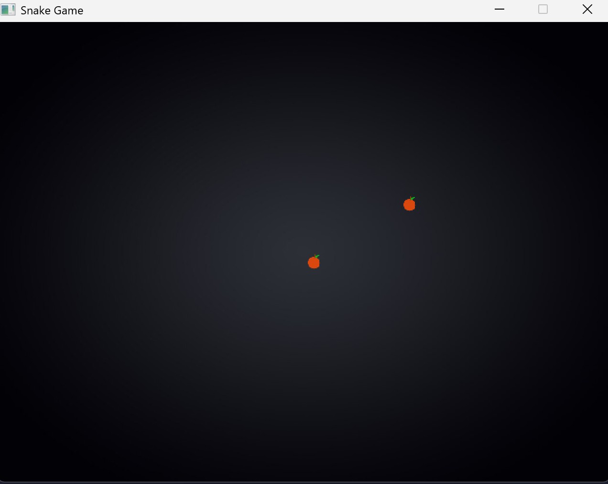
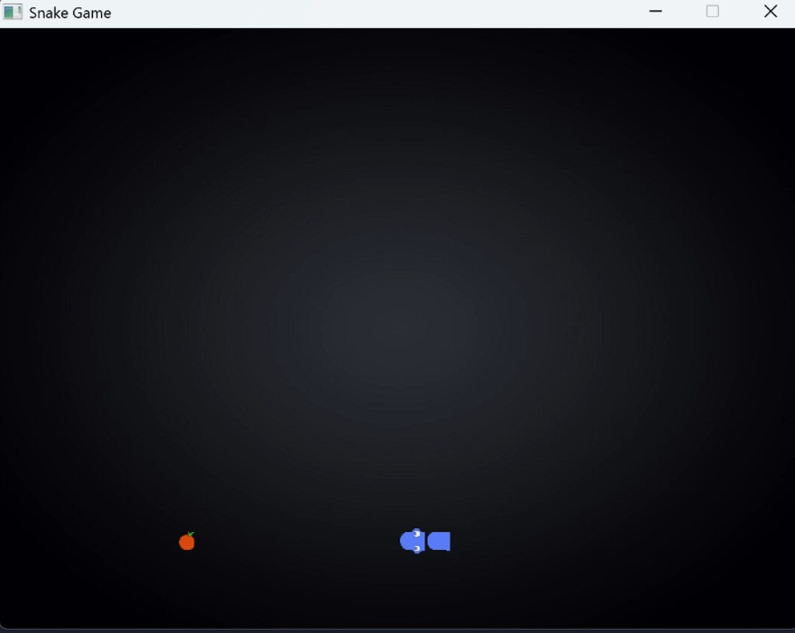

# [](https://wakatime.com/badge/github/EchoSingh/SnakeGame)🐍 Snake Game


https://github.com/user-attachments/assets/95bbca7f-8062-4418-8b80-b4aa8989fe55


A classic Snake Game with textured graphics, powered by SDL2 and C++. Enjoy the nostalgic gameplay with modern visuals!

## 🎮 Features

- 🖼️ Custom snake textures for the head, body, and tail.
- 🍎 Randomly generated fruit with a unique design.
- 🌌 A beautiful background to enhance the gaming experience.
- ⏩ Adjustable game speed for dynamic gameplay.

## 🗂️ Project Structure

```
SnakeGame/
├── Graphics
│   ├── apple.png
│   ├── background.png
│   ├── body_bottomleft.png
│   ├── body_bottomright.png
│   ├── body_horizontal.png
│   ├── body_topleft.png
│   ├── body_topright.png
│   ├── body_vertical.png
│   ├── head_down.png
│   ├── head_left.png
│   ├── head_right.png
│   ├── head_up.png
│   ├── tail_down.png
│   ├── tail_left.png
│   ├── tail_right.png
│   ├── tail_up.png
├── Screenshots
│   ├── 1_screenshot.jpg
│   ├── 2_screenshot.jpg
├── .gitignore
├── LICENSE
├── README.md
└── SnakeGame.cpp
```
## 🖼️ Screenshots

### Gameplay Screenshot


### Snake Growth Screenshot


## 📜 License

This project is licensed under the [MIT License](LICENSE).

## 🙏 Acknowledgments

- SDL2 and SDL2_image for the game framework.

---
Enjoy playing Snake Game! 🐍🍎


